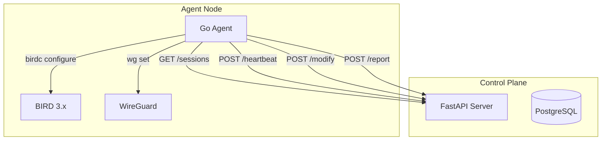
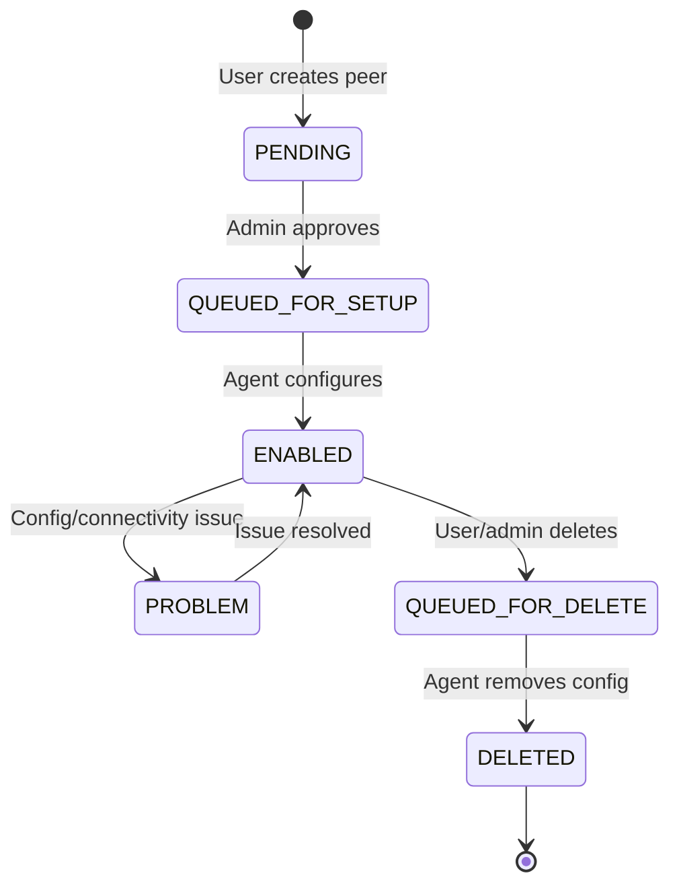

# MoeNet Agent

[](https://golang.org)

A Go agent for automated BGP peering session management on MoeNet DN42 infrastructure nodes. Communicates with the MoeNet Control Plane to orchestrate BGP session lifecycle, WireGuard tunnel configuration, and real-time performance metrics.

## Features

- **Session Lifecycle Management**: Automated setup, monitoring, and teardown of BGP peering sessions
- **BIRD Integration**: Connection pool for efficient BIRD control socket communication
- **WireGuard Management**: Direct interface management without wg-quick
- **P2P Mesh IGP**: WireGuard-based IGP underlay with Babel
- **Real-time Metrics**: RTT measurement, route statistics, traffic monitoring
- **Graceful Shutdown**: Context-based cancellation with proper resource cleanup

## Architecture



## Session Lifecycle



| Status             | Description                              |
|--------------------|-----------------------------------------|
| `PENDING`          | Awaiting admin approval                  |
| `QUEUED_FOR_SETUP` | Approved, waiting for agent to configure |
| `ENABLED`          | Active and configured                    |
| `PROBLEM`          | Configuration or connectivity issue      |
| `QUEUED_FOR_DELETE`| Marked for removal                       |
| `DELETED`          | Removed from system                      |
| `TEARDOWN`         | Emergency teardown (invalid config)      |

## Background Tasks

| Task              | Interval | Purpose                                  |
|-------------------|----------|------------------------------------------|
| `heartbeatTask`   | 30s      | Report node health, version, system metrics |
| `sessionSyncTask` | 60s      | Sync BGP sessions from CP, apply changes |
| `metricTask`      | 60s      | Collect BGP stats, report to CP          |
| `rttTask`         | 300s     | Measure RTT to peers, update latency tier |
| `meshSyncTask`    | 120s     | Sync P2P WireGuard IGP mesh              |
| `ibgpSyncTask`    | 120s     | Sync iBGP peer configurations            |

## Installation

### Binary Installation

```bash
# Download latest release
curl -L -o moenet-agent https://github.com/moenet/moenet-agent/releases/latest/download/moenet-agent-linux-amd64
chmod +x moenet-agent

# Create directories
mkdir -p /opt/moenet-agent/logs

# Copy configuration
cp config.example.json /opt/moenet-agent/config.json
# Edit config.json with your settings
```

### Building from Source

```bash
git clone https://github.com/moenet/moenet-agent.git
cd moenet-agent
go build -o moenet-agent ./cmd/moenet-agent
```

### Systemd Service

```bash
cp moenet-agent.service /etc/systemd/system/
systemctl daemon-reload
systemctl enable moenet-agent
systemctl start moenet-agent
```

## Configuration

### Bootstrap Mode (Recommended)

Agent can fetch configuration from Control Plane at startup:

```json
{
  "bootstrap": {
    "controlPlaneUrl": "https://api.moenet.work",
    "nodeName": "jp-edge",
    "token": "your-agent-token"
  },
  "server": { "listen": ":24368" }
}
```

The agent fetches `nodeId`, `region`, `loopback IPs`, and other settings from the database.

### Full Configuration

See [configs/config.example.json](configs/config.example.json) for a complete example.

| Section              | Key    | Description                      |
|----------------------|--------|----------------------------------|
| `node.name`          | string | Node hostname (e.g., `hk-edge`)  |
| `node.id`            | int    | Unique node ID (1-62)            |
| `controlPlane.url`   | string | Control Plane API URL            |
| `controlPlane.token` | string | Agent authentication token       |
| `bird.controlSocket` | string | BIRD control socket path         |
| `bird.peerConfDir`   | string | Directory for peer configs       |

## API Endpoints

The agent exposes a minimal HTTP API:

| Endpoint  | Method | Description                |
|-----------|--------|----------------------------|
| `/status` | GET    | Agent status and version   |
| `/sync`   | GET    | Trigger manual session sync |

## Development

```bash
# Run tests
go test ./...

# Build with version info
go build -ldflags="-X main.Version=1.0.0 -X main.Commit=$(git rev-parse --short HEAD)" ./cmd/moenet-agent
```

## Robustness Features

### HTTP Retry with Backoff

All Control Plane HTTP requests use exponential backoff retry:

```go
import "github.com/moenet/moenet-agent/internal/httpclient"

client := httpclient.New(nil, httpclient.RetryConfig{
    MaxRetries:   3,
    InitialDelay: time.Second,
    MaxDelay:     30 * time.Second,
    Multiplier:   2.0,
})

resp, err := client.Get(ctx, url)
```

Features:

- Configurable max retries and delays
- Jitter to prevent thundering herd
- Context-aware cancellation
- Automatic 5xx and 429 retry

### Circuit Breaker

Prevents cascading failures when Control Plane is unavailable:

```go
import "github.com/moenet/moenet-agent/internal/circuitbreaker"

cb := circuitbreaker.New(circuitbreaker.Config{
    FailureThreshold: 5,
    SuccessThreshold: 3,
    OpenDuration:     30 * time.Second,
})

err := cb.Execute(func() error {
    return sendRequest()
})
```

State transitions:

- **Closed** → **Open**: After 5 consecutive failures
- **Open** → **Half-Open**: After 30s timeout
- **Half-Open** → **Closed**: After 3 successes
- **Half-Open** → **Open**: On any failure

Configuration in `config.json`:

```json
{
  "controlPlane": {
    "maxRetries": 3,
    "retryInitialDelay": 1000
  }
}
```

## License

GPL-3.0
